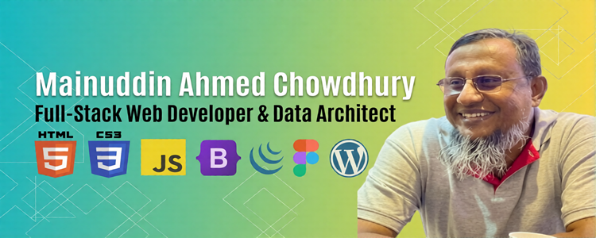

# Hi There! I'm Mainuddin Ahmed Chowdhury 👋

### 💻 Front-End Developer & WordPress Customization Specialist | Building Highly-Responsive Layouts & Dynamic Interfaces

I specialize in engineering fluid, mobile-responsive frontend web layouts and customizing robust content management systems. Bridging the gap between user experience mockups and production-ready code, I focus on transforming pixel-perfect designs from Figma templates into clean, highly optimized web layouts.

  

---

### 🧐 Why work with me?

* **Design-to-Code Translation:** I specialize in converting raw UI layouts directly into semantic code structures focused on layout execution, access optimization, and cross-browser responsiveness.
* **Component-Level Interactions:** Expert in mapping interactive navigation components, dynamic inventory sorters, and client-side form features seamlessly.
* **Professional Execution:** Committed to clean folder organization architectures, maintainable asset separation layouts, and clear client delivery timelines.

---

### 🛠️ Tech Stack & Capabilities

* **🖥️ Frontend Architecture:** HTML5 | CSS3 | JavaScript (ES6+) | jQuery | Responsive Web Design
* **🎨 Layout Frameworks:** Bootstrap 5 Framework | Fluid Mobile-Responsive Grids | UI Component Alignment
* **📦 Content Management Systems:** WordPress Production Customization | Child Theme Structure | Manual CSS Style Overrides
* **📐 Consulting Specialties:** Figma Design System Mapping | Component Hierarchy Planning | Performance Configuration

---

### 🗂️ Featured Client Projects

#### 💻 1. [High-Converting Sales Landing Page](https://github.com)
* **Tech Used:** Semantic HTML5, CSS3, Layout Optimization
* **Business Impact:** Engineered a lightweight front-end interface built from design prototypes, optimized explicitly for fast browser rendering.

#### 📊 2. [Interactive Product Filter](https://github.com)
* **Tech Used:** JavaScript, jQuery Engine, Bootstrap 5 Framework
* **Business Impact:** Developed an instant client-side data sorting layout grid allowing clients to sort inventory items without waiting for page reloads.

#### 🎨 3. [WordPress Corporate Theme Style-Kit](https://github.com)
* **Tech Used:** WordPress Architecture, Child Theme Overrides, Clean Custom CSS
* **Business Impact:** Designed manual style sheets to override core Gutenberg blocks layout spacing rules cleanly without relying on page-builder plugins.

---

### 📊 My GitHub Stats

  

  

---

### 🤝 Let's Discuss Your Project

I am currently accepting freelance web development contracts and technical collaborations worldwide. If you need a developer who delivers robust architecture and reliable code on time, let's connect.

